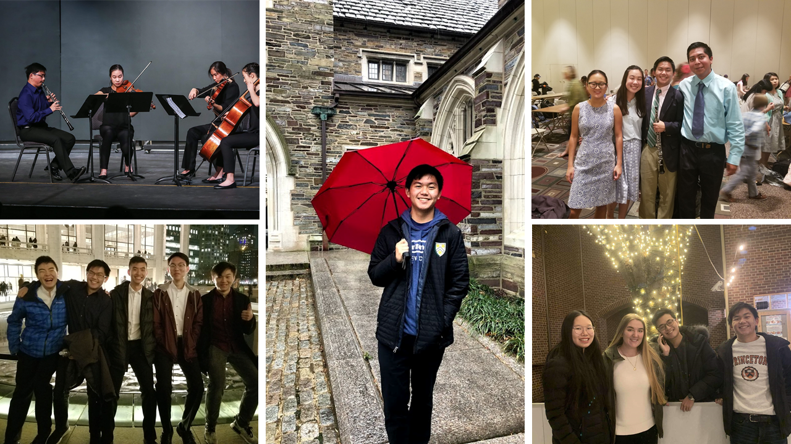

  I'm a current second year student at Princeton university studying Electrical Engineering with two minors in applications of computing and robtics and intelligence systems. Since I was little I've been a huge Star Wars fan which started my interest in space and a dream that I would be able to fly a working X-wing. Now that I'm all grown up (for the most part), I still love space and continue to be optimistic of working on future robotic space exploration missions. Additionally, I love playing oboe which has given me so many opportunities and taken me to amazing places. I've been in the background of "Little Fires Everywhere" and have performed and travelled to places like Carnegie Hall and the New World Center. Playing music has allowed me to meet so many people whom I've held close relationships with for several years and I hope to expand my circle to people who share a drive of sending technology into space.

