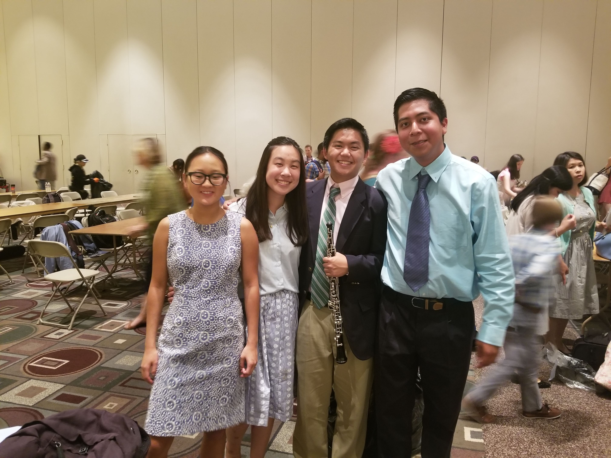
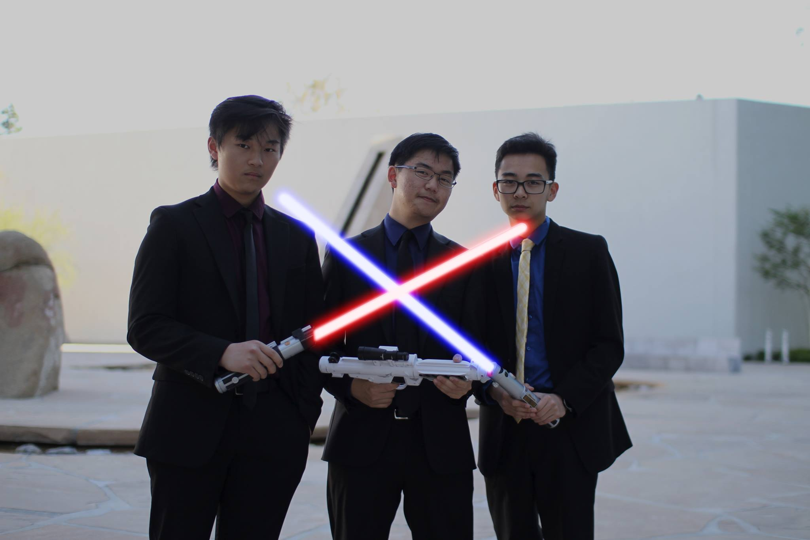

  I'm a current second year student at Princeton university studying Electrical Engineering with two minors in applications of computing and robtics and intelligence systems. Since I was little I've been a huge Star Wars fan which started my interest in space and a dream that I would be able to fly a working X-wing. Now that I'm all grown up (for the most part), I still love space and continue to be optimistic of working on future robotic space exploration missions. Additionally, I love playing oboe which has given me sooooooo many opportunities and taken me to amazing places.  

| First Header  | Second Header |
| ------------- | ------------- |
|   |   |

