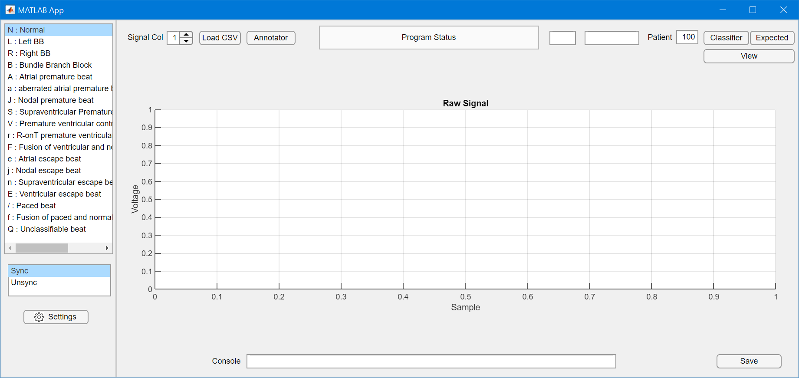

As part of my 2020 internship at Percassist I created a series of MATLAB tools to aid in research and development of their QRS detection algorithm. These tools allowed the algorithm team to visualize and assess different iterations of their algorithm along with the ability to create artificial cases of how the algorithm should be performing. 

