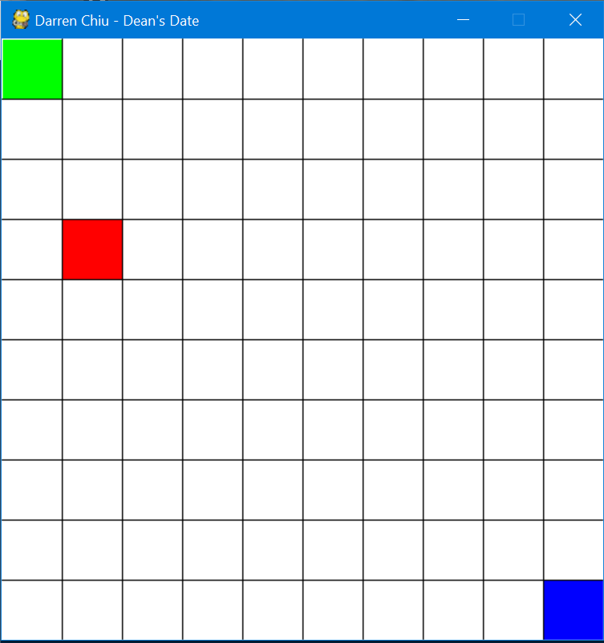

In support of my final paper written for WRI115: Systems of Play, I programmed a simple two player game in which players must compete using the same keyboard, arrow keys or WASD, in order to fight for a randomly moving red square. The concept of the game was kept simple in order to showcase the effects of randomly generated elements that are used to support attention in popular video games. 

