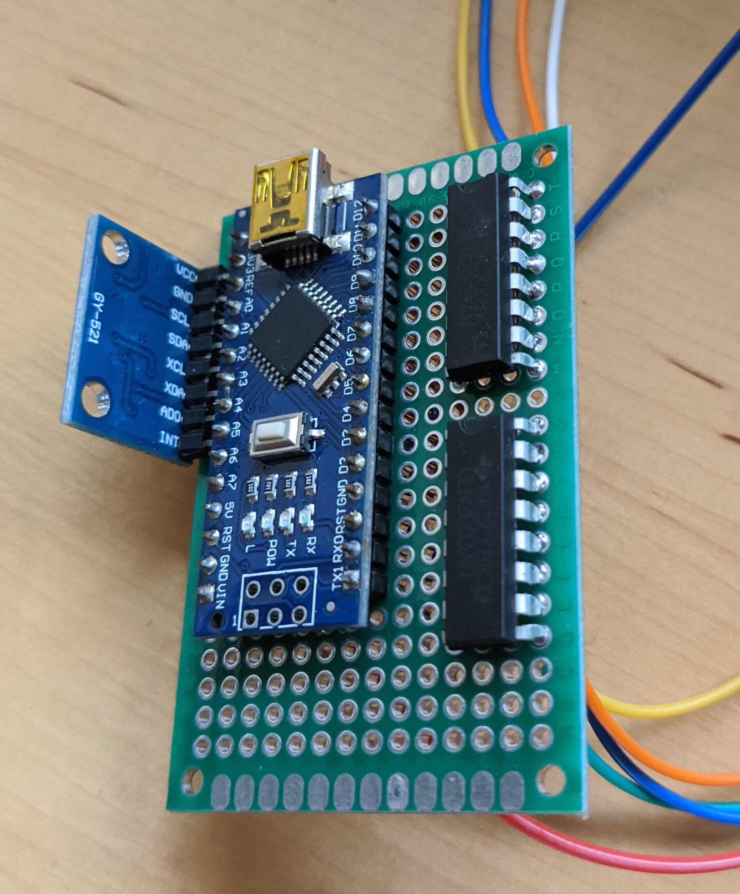

<b> As this is an ongoing project I'll be tracking updates on this page </b>  

 Currently, I've been experimenting with different configurations on a protoboard for the self balancing robot. The idea is that gyroscope data will be collected through the MPU6050 which will then be processed using a PID loop (which I'm still learning), and finally a reaction to some external force will be handled through the stepper motors. The protoboard shown below uses two darlington arrays to boost the current needed to overcome the intertia in each motor. However, I think in a future iteration I will just be using one darlington IC as I don't think I will need specific control on either the left or right motor. 

